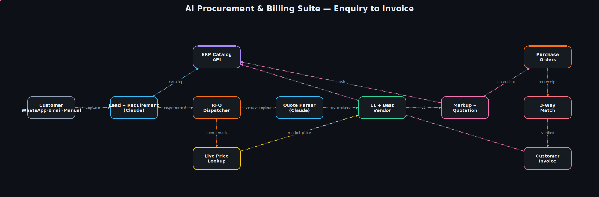

# AI Procurement & Billing Suite

**From a customer enquiry to a paid invoice — automatically.** Capture an
enquiry on WhatsApp, email, or manually; let Claude understand what's actually
being asked for; fan a request-for-quotation out to your vendors; normalize
whatever they reply with; pick the L1 (lowest) price against a live market
benchmark; quote the customer with your markup; raise the purchase orders;
3-way match the goods-receipt invoice against each PO; and bill the customer —
with every quotation and invoice pushed straight into your ERP.



> 📽️ A matching animated GIF is in [`assets/architecture.gif`](assets/architecture.gif).

---

## Overview

Distributors and system integrators live in the gap between *"what does the
customer want"* and *"what will it cost me to deliver it."* Today that gap is
filled by hand: reading enquiries, WhatsApping a handful of vendors, copying
prices out of replies that never share a format, tallying it into a quote,
adding a margin, cutting POs, checking the material against the PO when it
arrives, and finally invoicing. Every step is manual, and every step leaks time
and margin.

This suite automates the whole loop. Claude does the language-heavy work —
understanding a terse enquiry like *"Need CCTV 16 camera setup"* into a real
bill of materials, and turning vendor replies in **any** format into one clean,
comparable structure. Deterministic engines do the commercial work — L1
selection, markup, PO grouping, and 3-way matching — so the numbers are exact
and auditable. The ERP stays the system of record: the catalog is read from it,
and finished quotations and invoices are written back to it.

## Architecture walkthrough

The pipeline flows left to right, exactly as the diagram shows:

1. **Channels → Lead** — WhatsApp, email, and a manual/API entry point are each
   a `ChannelConnector` that normalizes an inbound enquiry into a `Lead`.
2. **Requirement understanding (Claude)** — the `RequirementParser` agent turns
   the free-text enquiry into a structured `Requirement` (a bill of materials),
   expanding implied items (a CCTV setup ⇒ cameras + NVR + cabling + install).
3. **ERP catalog** — requirement lines are resolved against the ERP product
   catalog fetched over its API; an item not yet listed can be created on the fly.
4. **RFQ dispatcher** — a rendered request-for-quotation is fanned out to every
   candidate vendor over their channel.
5. **Live price lookup** — current online/market prices are pulled in parallel so
   the comparison has a benchmark even before vendors reply.
6. **Quote parser (Claude)** — the `QuoteExtractor` agent normalizes each vendor
   reply — free text, a table, a forwarded message — into structured `QuoteLine`s
   using schema-constrained (structured) outputs. *This is the answer to the
   "vendors reply in different formats" problem.*
7. **L1 + best vendor** — the `ComparisonEngine` picks the lowest price per line
   (ties broken by vendor rating) and tallies an overall best vendor.
8. **Markup + quotation** — the margin engine applies a blanket **or** per-item
   markup, builds the customer quotation, and pushes it to the ERP.
9. **Purchase orders** — on acceptance, won lines are grouped by vendor into POs,
   each with a delivery timeline.
10. **3-way match** — on goods receipt, each vendor's purchase invoice is
    reconciled line-by-line against its PO; price/quantity drift and missing lines
    are flagged in a report.
11. **Customer invoice** — the accepted quotation becomes the customer invoice,
    also pushed to the ERP.

The `ProcurementOrchestrator` wires these stages together and injects every
collaborator, so the pipeline runs against real connectors in production and
against fakes in tests.

## Tech stack

| Concern | Technology |
|---|---|
| Language | Python 3.11 |
| API | FastAPI + Uvicorn |
| LLM (understanding, extraction, negotiation) | Anthropic **Claude** (`claude-opus-4-8`) with adaptive thinking + structured outputs |
| Domain models / validation | Pydantic v2 |
| HTTP to ERP / channels | httpx |
| Config | pydantic-settings (`.env`) |
| Tests | pytest |

## Project structure

```
ai-procurement-billing-suite/
├── src/procurement_suite/
│   ├── config.py                 # env-driven settings (no hardcoded secrets)
│   ├── models.py                 # Pydantic domain models shared across stages
│   ├── orchestrator.py           # wires the end-to-end flow together
│   ├── llm/
│   │   ├── client.py             # Anthropic SDK wrapper (JSON + free text)
│   │   ├── requirement_parser.py # enquiry text  -> structured BOM  (Claude)
│   │   ├── quote_extractor.py    # any-format reply -> QuoteLines    (Claude)
│   │   └── negotiator.py         # "beat this price" auto-negotiation (Claude)
│   ├── connectors/
│   │   ├── base.py               # ChannelConnector protocol
│   │   ├── whatsapp.py           # Meta Cloud API / Twilio
│   │   ├── email.py              # IMAP in / SMTP out
│   │   ├── erp.py                # catalog fetch, add product, push quote/invoice
│   │   └── price_lookup.py       # live online market prices
│   ├── pipeline/
│   │   ├── rfq.py                # dispatch RFQ to vendors
│   │   ├── comparison.py         # L1 + best-vendor engine
│   │   ├── quotation.py          # markup -> customer quotation
│   │   ├── procurement.py        # POs per vendor with timelines
│   │   ├── matching.py           # 3-way match (PO vs purchase invoice)
│   │   └── billing.py            # customer invoice
│   ├── services/
│   │   ├── markup.py             # margin engine (overall / per-item)
│   │   └── vendor_rating.py      # 0–5 vendor score
│   └── api/app.py                # FastAPI surface mirroring the stages
├── tests/                        # comparison, markup, 3-way matching
├── assets/                       # architecture spec + animated svg/gif
├── pyproject.toml
├── Makefile
└── .env.example
```

## Getting started

**Prerequisites:** Python 3.11+, an Anthropic API key, and (for a full run)
ERP + WhatsApp/email credentials.

```bash
# 1. Install (editable, with dev tools)
make dev            # or: python3 -m pip install -e ".[dev]"

# 2. Configure
cp .env.example .env
# edit .env with your ANTHROPIC_API_KEY, ERP_BASE_URL, channel creds, markup %

# 3. Run the API
make run            # uvicorn on http://localhost:8000  (/docs for OpenAPI)
```

Turn an enquiry into a structured bill of materials:

```bash
curl -s localhost:8000/enquiries \
  -H 'content-type: application/json' \
  -d '{"text": "Need CCTV 16 camera setup with NVR and installation"}'
```

## Testing

```bash
make test           # or: python3 -m pytest -q
```

The suite covers the commercial core — L1 selection (including rating
tie-breaks), overall-vs-per-item markup, and 3-way matching (clean match,
price mismatch, missing line). Tests run green against the stubbed connectors,
with no network or API key required.

## Roadmap — what a full build adds

The connectors and LLM agents here have real, idiomatic seams with stubbed
network calls; a production build fills them in and adds:

- **Live channel webhooks** — Meta Cloud API / Twilio inbound + IMAP polling,
  wired to the intake stage.
- **Persistence** — Postgres for leads, quotes, POs, and match reports; an audit
  trail on every stage.
- **Web-search price lookup** — Claude's server-side web-search tool for real
  market benchmarks instead of a stub.
- **Auto-negotiation loop** — the `Negotiator` agent runs a bounded
  counter-offer cycle before finalizing L1.
- **Approvals & roles** — human sign-off gates on quotations and POs.
- **Analytics** — margin, vendor performance, and cycle-time dashboards.

---

*Starter architecture by **Arpit Singh** — Senior AI & Data Engineer.*
